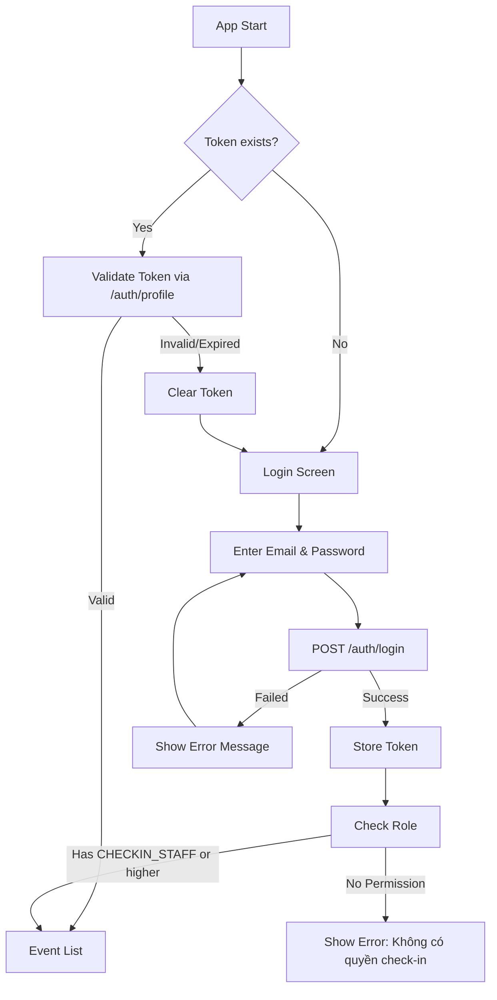
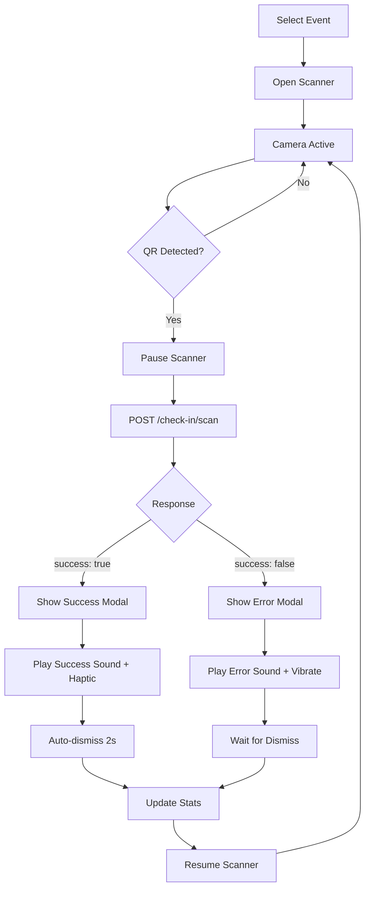

# 📱 Mobile Check-in App - Hướng Dẫn Phát Triển Chi Tiết

> Tài liệu hướng dẫn phát triển ứng dụng mobile cho nhân viên check-in sự kiện bằng QR code.

---

## 📋 Mục Lục

1. [Tổng Quan](#1-tổng-quan)
2. [Yêu Cầu Hệ Thống](#2-yêu-cầu-hệ-thống)
3. [Kiến Trúc Ứng Dụng](#3-kiến-trúc-ứng-dụng)
4. [API Reference](#4-api-reference)
5. [Màn Hình & UI Components](#5-màn-hình--ui-components)
6. [User Flows](#6-user-flows)
7. [State Management](#7-state-management)
8. [Error Handling](#8-error-handling)
9. [Security](#9-security)
10. [Testing](#10-testing)
11. [Deployment](#11-deployment)

---

## 1. Tổng Quan

### 1.1 Mục Đích
Ứng dụng Mobile Check-in cho phép nhân viên (CHECKIN_STAFF) quét mã QR trên vé để check-in khách tham dự sự kiện. App cung cấp:
- Quét QR code nhanh chóng
- Xác nhận check-in real-time
- Thống kê check-in theo event
- Lịch sử quét của nhân viên

### 1.2 Target Users
- **Primary**: CHECKIN_STAFF - Nhân viên check-in
- **Secondary**: EVENT_MANAGER, ORGANIZER_ADMIN - Có thể check-in + xem full stats

### 1.3 Platforms
- iOS 13.0+
- Android 8.0+ (API Level 26)

---

## 2. Yêu Cầu Hệ Thống

### 2.1 Technical Requirements

| Component | Requirement |
|-----------|-------------|
| Camera | Rear camera với autofocus |
| Network | 3G/4G/5G hoặc WiFi |
| Storage | 50MB+ free space |
| RAM | 2GB+ |

### 2.2 Permissions Cần Thiết

```xml
<!-- Android (AndroidManifest.xml) -->
<uses-permission android:name="android.permission.CAMERA" />
<uses-permission android:name="android.permission.INTERNET" />
<uses-permission android:name="android.permission.VIBRATE" />

<!-- iOS (Info.plist) -->
<key>NSCameraUsageDescription</key>
<string>App cần truy cập camera để quét mã QR check-in</string>
```

### 2.3 Tech Stack Đề Xuất

**Option 1: React Native (Recommended)**
```json
{
  "dependencies": {
    "react-native": "0.73.x",
    "@react-navigation/native": "^6.x",
    "@react-navigation/bottom-tabs": "^6.x",
    "react-native-camera": "^4.x",
    "react-native-vision-camera": "^3.x",
    "@react-native-async-storage/async-storage": "^1.x",
    "axios": "^1.x",
    "react-native-haptic-feedback": "^2.x",
    "react-native-sound": "^0.11.x",
    "react-native-vector-icons": "^10.x",
    "zustand": "^4.x"
  }
}
```

**Option 2: Flutter**
```yaml
dependencies:
  flutter:
    sdk: flutter
  mobile_scanner: ^5.0.0
  dio: ^5.0.0
  flutter_secure_storage: ^9.0.0
  provider: ^6.0.0
  vibration: ^1.8.0
  audioplayers: ^5.0.0
```

---

## 3. Kiến Trúc Ứng Dụng

### 3.1 Folder Structure (React Native)

```
src/
├── api/
│   ├── client.ts           # Axios instance
│   ├── auth.api.ts         # Auth endpoints
│   ├── events.api.ts       # Events endpoints
│   └── checkin.api.ts      # Check-in endpoints
├── components/
│   ├── common/
│   │   ├── Button.tsx
│   │   ├── Card.tsx
│   │   ├── Input.tsx
│   │   └── Loading.tsx
│   ├── scanner/
│   │   ├── QRScanner.tsx
│   │   └── ScanOverlay.tsx
│   └── results/
│       ├── SuccessModal.tsx
│       └── ErrorModal.tsx
├── screens/
│   ├── SplashScreen.tsx
│   ├── LoginScreen.tsx
│   ├── EventListScreen.tsx
│   ├── CheckinScreen.tsx
│   ├── HistoryScreen.tsx
│   ├── StatsScreen.tsx
│   └── ProfileScreen.tsx
├── navigation/
│   ├── AppNavigator.tsx
│   ├── AuthNavigator.tsx
│   └── MainNavigator.tsx
├── store/
│   ├── authStore.ts
│   ├── eventStore.ts
│   └── checkinStore.ts
├── hooks/
│   ├── useAuth.ts
│   └── useCheckin.ts
├── utils/
│   ├── storage.ts
│   ├── sounds.ts
│   └── haptics.ts
├── types/
│   └── index.ts
└── App.tsx
```

### 3.2 Component Hierarchy

```
App
├── AppNavigator
│   ├── AuthNavigator (unauthenticated)
│   │   ├── SplashScreen
│   │   └── LoginScreen
│   │
│   └── MainNavigator (authenticated)
│       ├── EventListScreen
│       │   └── EventCard
│       │
│       └── CheckinTabNavigator
│           ├── ScannerTab
│           │   ├── QRScanner
│           │   ├── GateSelector
│           │   ├── StatsBar
│           │   ├── SuccessModal
│           │   └── ErrorModal
│           │
│           ├── HistoryTab
│           │   ├── SearchBar
│           │   ├── FilterOptions
│           │   └── HistoryList
│           │
│           └── StatsTab
│               ├── OverviewCards
│               └── TicketTypeChart
```

---

## 4. API Reference

### 4.1 Base Configuration

```typescript
// api/client.ts
import axios from 'axios';
import AsyncStorage from '@react-native-async-storage/async-storage';

const API_BASE_URL = 'https://your-api-domain.com';

const apiClient = axios.create({
  baseURL: API_BASE_URL,
  timeout: 10000,
  headers: {
    'Content-Type': 'application/json',
  },
});

// Request interceptor - add token
apiClient.interceptors.request.use(async (config) => {
  const token = await AsyncStorage.getItem('access_token');
  if (token) {
    config.headers.Authorization = `Bearer ${token}`;
  }
  return config;
});

// Response interceptor - handle 401
apiClient.interceptors.response.use(
  (response) => response,
  async (error) => {
    if (error.response?.status === 401) {
      await AsyncStorage.removeItem('access_token');
      // Navigate to login
    }
    return Promise.reject(error);
  }
);

export default apiClient;
```

### 4.2 Authentication APIs

#### 4.2.1 Login

```typescript
// api/auth.api.ts
interface LoginRequest {
  email: string;
  password: string;
}

interface LoginResponse {
  access_token: string;
  user: {
    id: string;
    email: string;
    full_name: string;
    platform_role: string;
    organizations: Array<{
      organization_id: string;
      organization_name: string;
      role: string;
    }>;
  };
}

export const login = async (data: LoginRequest): Promise<LoginResponse> => {
  const response = await apiClient.post('/auth/login', data);
  return response.data;
};
```

**Request:**
```http
POST /auth/login
Content-Type: application/json

{
  "email": "staff@example.com",
  "password": "password123"
}
```

**Response (200 OK):**
```json
{
  "access_token": "eyJhbGciOiJIUzI1NiIsInR5cCI6IkpXVCJ9...",
  "user": {
    "id": "uuid-here",
    "email": "staff@example.com",
    "full_name": "Nguyễn Văn A",
    "platform_role": "CUSTOMER",
    "organizations": [
      {
        "organization_id": "org-uuid",
        "organization_name": "Tổ chức ABC",
        "role": "CHECKIN_STAFF"
      }
    ]
  }
}
```

**Error Responses:**
```json
// 401 Unauthorized
{
  "statusCode": 401,
  "message": "Email hoặc mật khẩu không đúng"
}

// 403 Forbidden (tài khoản chưa verify)
{
  "statusCode": 403,
  "message": "Tài khoản chưa được xác thực. Vui lòng kiểm tra email."
}
```

#### 4.2.2 Get Profile

```typescript
export const getProfile = async (): Promise<User> => {
  const response = await apiClient.get('/auth/profile');
  return response.data;
};
```

**Request:**
```http
GET /auth/profile
Authorization: Bearer {access_token}
```

**Response (200 OK):**
```json
{
  "id": "uuid-here",
  "email": "staff@example.com",
  "full_name": "Nguyễn Văn A",
  "phone": "0901234567",
  "avatar_url": "https://...",
  "platform_role": "CUSTOMER",
  "is_verified": true,
  "organizations": [...]
}
```

#### 4.2.3 Logout

```typescript
export const logout = async (): Promise<void> => {
  await apiClient.post('/auth/logout');
};
```

**Request:**
```http
POST /auth/logout
Authorization: Bearer {access_token}
```

**Response (200 OK):**
```json
{
  "message": "Đăng xuất thành công"
}
```

---

### 4.3 Events APIs

#### 4.3.1 Get Event List

```typescript
// api/events.api.ts
interface EventsQuery {
  page?: number;
  limit?: number;
  status?: 'PUBLISHED' | 'SCHEDULED';
}

interface EventListResponse {
  data: Event[];
  meta: {
    total: number;
    page: number;
    limit: number;
    totalPages: number;
  };
}

export const getEvents = async (query?: EventsQuery): Promise<EventListResponse> => {
  const response = await apiClient.get('/events', { params: query });
  return response.data;
};
```

**Request:**
```http
GET /events?page=1&limit=20&status=PUBLISHED
Authorization: Bearer {access_token}
```

**Response (200 OK):**
```json
{
  "data": [
    {
      "id": "event-uuid-1",
      "title": "Concert ABC",
      "slug": "concert-abc",
      "subtitle": "Live Music Show",
      "start_at": "2026-01-20T19:00:00.000Z",
      "end_at": "2026-01-20T23:00:00.000Z",
      "timezone": "Asia/Ho_Chi_Minh",
      "venue_name": "Nhà hát Lớn",
      "city": "TP.HCM",
      "status": "PUBLISHED",
      "cover_image_url": "https://example.com/image.jpg",
      "organization": {
        "id": "org-uuid",
        "name": "Tổ chức ABC"
      },
      "_count": {
        "tickets": 500
      }
    }
  ],
  "meta": {
    "total": 10,
    "page": 1,
    "limit": 20,
    "totalPages": 1
  }
}
```

#### 4.3.2 Get Event Detail

```typescript
export const getEventById = async (eventId: string): Promise<Event> => {
  const response = await apiClient.get(`/events/${eventId}`);
  return response.data;
};
```

**Request:**
```http
GET /events/{eventId}
Authorization: Bearer {access_token}
```

**Response (200 OK):**
```json
{
  "id": "event-uuid",
  "title": "Concert ABC",
  "subtitle": "Live Music Show",
  "description": "Mô tả sự kiện...",
  "start_at": "2026-01-20T19:00:00.000Z",
  "end_at": "2026-01-20T23:00:00.000Z",
  "timezone": "Asia/Ho_Chi_Minh",
  "venue_name": "Nhà hát Lớn",
  "address_line1": "123 Đường ABC",
  "district": "Quận 1",
  "city": "TP.HCM",
  "status": "PUBLISHED",
  "cover_image_url": "https://...",
  "ticket_types": [
    {
      "id": "tt-uuid",
      "name": "VIP",
      "price": 500000,
      "quantity_total": 100,
      "quantity_sold": 50
    },
    {
      "id": "tt-uuid-2",
      "name": "Standard",
      "price": 200000,
      "quantity_total": 400,
      "quantity_sold": 300
    }
  ]
}
```

---

### 4.4 Check-in APIs (Core)

#### 4.4.1 ⭐ Scan QR - API Chính

```typescript
// api/checkin.api.ts
interface ScanQRRequest {
  qr_payload: string;
  gate?: string;
  device_id?: string;
}

interface ScanQRResponse {
  success: boolean;
  message: string;
  result?: 'SUCCESS' | 'ALREADY_USED' | 'NOT_FOUND' | 'REVOKED' | 'REFUNDED' | 'EVENT_NOT_ACTIVE' | 'INVALID_STATUS';
  ticket?: {
    id: string;
    ticket_serial: string;
    attendee_name: string;
    attendee_email: string;
    attendee_phone?: string;
    ticket_type: string;
    event_id: string;
    event_title: string;
    checkin_status: 'CHECKED_IN' | 'NOT_CHECKED_IN';
    checked_in_at?: string;
    checked_in_by?: string;
    scan_count: number;
  };
}

export const scanQR = async (data: ScanQRRequest): Promise<ScanQRResponse> => {
  const response = await apiClient.post('/check-in/scan', data);
  return response.data;
};
```

**Request:**
```http
POST /check-in/scan
Authorization: Bearer {access_token}
Content-Type: application/json

{
  "qr_payload": "TKT-ABC123XYZ789",
  "gate": "Cổng A",
  "device_id": "iPhone-12-Staff001"
}
```

**Response - Success (200 OK):**
```json
{
  "success": true,
  "message": "Check-in thành công",
  "result": "SUCCESS",
  "ticket": {
    "id": "ticket-uuid",
    "ticket_serial": "VIP-001",
    "attendee_name": "Nguyễn Văn A",
    "attendee_email": "a@example.com",
    "attendee_phone": "0901234567",
    "ticket_type": "VIP",
    "event_id": "event-uuid",
    "event_title": "Concert ABC",
    "checkin_status": "CHECKED_IN",
    "checked_in_at": "2026-01-20T19:05:00.000Z",
    "scan_count": 1
  }
}
```

**Response - Already Checked In:**
```json
{
  "success": false,
  "message": "Vé đã được check-in lúc 19:00 bởi Staff B",
  "result": "ALREADY_USED",
  "ticket": {
    "id": "ticket-uuid",
    "ticket_serial": "VIP-001",
    "attendee_name": "Nguyễn Văn A",
    "attendee_email": "a@example.com",
    "ticket_type": "VIP",
    "checkin_status": "CHECKED_IN",
    "checked_in_at": "2026-01-20T19:00:00.000Z",
    "checked_in_by": "Staff B",
    "scan_count": 2
  }
}
```

**Response - Not Found:**
```json
{
  "success": false,
  "message": "Không tìm thấy vé với mã QR này",
  "result": "NOT_FOUND"
}
```

**Tất cả Scan Results:**

| Result | Mô tả | UI Action |
|--------|-------|-----------|
| `SUCCESS` | Check-in thành công | ✅ Green modal + Success sound |
| `ALREADY_USED` | Vé đã check-in trước đó | ⚠️ Yellow modal + Warning sound |
| `NOT_FOUND` | Không tìm thấy vé | ❌ Red modal + Error sound |
| `REVOKED` | Vé đã bị thu hồi | ❌ Red modal + Error sound |
| `REFUNDED` | Vé đã được hoàn tiền | ❌ Red modal + Error sound |
| `EVENT_NOT_ACTIVE` | Sự kiện chưa active | ⚠️ Yellow modal |
| `INVALID_STATUS` | Trạng thái vé không hợp lệ | ❌ Red modal |

#### 4.4.2 Get Check-in Stats

```typescript
interface CheckinStats {
  total_tickets: number;
  checked_in: number;
  not_checked_in: number;
  checkin_rate: number;
  by_ticket_type: Array<{
    ticket_type_id: string;
    ticket_type_name: string;
    total: number;
    checked_in: number;
    rate: number;
  }>;
}

export const getCheckinStats = async (eventId: string): Promise<CheckinStats> => {
  const response = await apiClient.get(`/check-in/events/${eventId}/stats`);
  return response.data;
};
```

**Request:**
```http
GET /check-in/events/{eventId}/stats
Authorization: Bearer {access_token}
```

**Response (200 OK):**
```json
{
  "total_tickets": 500,
  "checked_in": 350,
  "not_checked_in": 150,
  "checkin_rate": 70,
  "by_ticket_type": [
    {
      "ticket_type_id": "tt-uuid-1",
      "ticket_type_name": "VIP",
      "total": 100,
      "checked_in": 80,
      "rate": 80
    },
    {
      "ticket_type_id": "tt-uuid-2",
      "ticket_type_name": "Standard",
      "total": 400,
      "checked_in": 270,
      "rate": 67.5
    }
  ]
}
```

#### 4.4.3 Get Check-in History

```typescript
interface CheckinHistoryQuery {
  page?: number;
  limit?: number;
  search?: string;
  ticket_type_id?: string;
  sort_by?: 'checked_in_at' | 'attendee_name';
  sort_order?: 'asc' | 'desc';
}

interface CheckinHistoryItem {
  id: string;
  ticket_id: string;
  ticket_serial: string;
  attendee_name: string;
  attendee_email: string;
  ticket_type_name: string;
  checked_in_at: string;
  gate: string;
  staff_name: string;
}

interface CheckinHistoryResponse {
  data: CheckinHistoryItem[];
  meta: {
    total: number;
    page: number;
    limit: number;
    totalPages: number;
  };
}

export const getCheckinHistory = async (
  eventId: string,
  query?: CheckinHistoryQuery
): Promise<CheckinHistoryResponse> => {
  const response = await apiClient.get(`/check-in/events/${eventId}/history`, { params: query });
  return response.data;
};
```

**Request:**
```http
GET /check-in/events/{eventId}/history?page=1&limit=20&search=Nguyen
Authorization: Bearer {access_token}
```

**Response (200 OK):**
```json
{
  "data": [
    {
      "id": "log-uuid",
      "ticket_id": "ticket-uuid",
      "ticket_serial": "VIP-001",
      "attendee_name": "Nguyễn Văn A",
      "attendee_email": "a@example.com",
      "ticket_type_name": "VIP",
      "checked_in_at": "2026-01-20T19:05:00.000Z",
      "gate": "Cổng A",
      "staff_name": "Staff ABC"
    }
  ],
  "meta": {
    "total": 350,
    "page": 1,
    "limit": 20,
    "totalPages": 18
  }
}
```

---

## 5. Màn Hình & UI Components

### 5.1 Màn Hình Chi Tiết

#### 5.1.1 Splash Screen

```
┌─────────────────────────────┐
│                             │
│                             │
│                             │
│         [APP LOGO]          │
│                             │
│      QR Event Check-in      │
│                             │
│         ◉◉◉ (loading)       │
│                             │
│                             │
│                             │
└─────────────────────────────┘
```

**Logic:**
```typescript
useEffect(() => {
  const checkAuth = async () => {
    const token = await AsyncStorage.getItem('access_token');
    if (token) {
      try {
        await getProfile();
        navigation.replace('MainNavigator');
      } catch {
        navigation.replace('Login');
      }
    } else {
      navigation.replace('Login');
    }
  };
  
  setTimeout(checkAuth, 1500);
}, []);
```

#### 5.1.2 Login Screen

```
┌─────────────────────────────┐
│                             │
│         [APP LOGO]          │
│                             │
│    ───────────────────      │
│    │  📧 Email           │  │
│    ───────────────────      │
│                             │
│    ───────────────────      │
│    │  🔒 Mật khẩu     👁️ │  │
│    ───────────────────      │
│                             │
│    ☑️ Ghi nhớ đăng nhập     │
│                             │
│    ┌─────────────────┐      │
│    │   ĐĂNG NHẬP     │      │
│    └─────────────────┘      │
│                             │
│    ❌ Email hoặc mật khẩu   │
│       không đúng            │
│                             │
└─────────────────────────────┘
```

**Components:**
- Email Input (keyboard: email-address)
- Password Input (secureTextEntry + toggle)
- Remember Me Checkbox
- Login Button (loading state)
- Error Message

#### 5.1.3 Event List Screen

```
┌─────────────────────────────┐
│ ☰  Sự kiện của tôi     👤   │
├─────────────────────────────┤
│ ┌─────────────────────────┐ │
│ │ [IMAGE]                 │ │
│ │ Concert ABC             │ │
│ │ 📅 20/01/2026, 19:00    │ │
│ │ 📍 Nhà hát Lớn, TP.HCM  │ │
│ │ ✅ 350/500 checked-in   │ │
│ │ ███████░░░ 70%          │ │
│ └─────────────────────────┘ │
│                             │
│ ┌─────────────────────────┐ │
│ │ [IMAGE]                 │ │
│ │ Festival XYZ            │ │
│ │ 📅 25/01/2026, 09:00    │ │
│ │ 📍 Công viên ABC        │ │
│ │ ⏳ Chưa bắt đầu         │ │
│ └─────────────────────────┘ │
│                             │
└─────────────────────────────┘
```

**Features:**
- Pull-to-refresh
- Event card với stats preview
- Tap card → Navigate to Check-in Screen
- Empty state khi không có events

#### 5.1.4 Check-in Screen (Main)

```
┌─────────────────────────────┐
│ ←  Concert ABC              │
├─────────────────────────────┤
│ ┌───────────────────────────┤
│ │ ✅ 350    │ ⏳ 150   │ 70%││
│ │ Đã check  │ Còn lại  │    ││
│ └───────────────────────────┤
├─────────────────────────────┤
│  Cổng: [  Cổng A  ▼]        │
├─────────────────────────────┤
│                             │
│   ┌─────────────────────┐   │
│   │                     │   │
│   │    ┌───────────┐    │   │
│   │    │           │    │   │
│   │    │  QR SCAN  │    │   │
│   │    │   AREA    │    │   │
│   │    │           │    │   │
│   │    └───────────┘    │   │
│   │                     │   │
│   └─────────────────────┘   │
│                             │
│   💡 Đưa mã QR vào khung    │
│                             │
├─────────────────────────────┤
│  [📷 Quét] [📜 Lịch sử] [📊]│
└─────────────────────────────┘
```

**Components:**
- Stats Bar (real-time update)
- Gate Selector Dropdown
- Camera Preview with Overlay
- Bottom Tab Navigation
- Flash Toggle Button

#### 5.1.5 Success Modal

```
┌─────────────────────────────┐
│                             │
│           ✅                │
│      (animation)            │
│                             │
│    CHECK-IN THÀNH CÔNG      │
│                             │
│    Nguyễn Văn A             │
│    VIP-001                  │
│    Loại vé: VIP             │
│                             │
│                             │
└─────────────────────────────┘
        (Auto-dismiss 2s)
```

**Behavior:**
- Green background với checkmark animation
- Haptic feedback (success)
- Play success sound
- Auto-dismiss sau 2 giây
- Resume scanning

#### 5.1.6 Error Modal

```
┌─────────────────────────────┐
│                             │
│           ❌                │
│      (animation)            │
│                             │
│    VÉ ĐÃ ĐƯỢC CHECK-IN      │
│                             │
│    Nguyễn Văn A             │
│    VIP-001                  │
│                             │
│    Đã check-in lúc 19:00    │
│    bởi: Staff B             │
│                             │
│    ┌─────────────────┐      │
│    │      ĐÓNG       │      │
│    └─────────────────┘      │
│                             │
└─────────────────────────────┘
```

**Behavior:**
- Red/Yellow background
- Vibration feedback
- Play error sound
- Manual dismiss required
- Show previous check-in info if available

#### 5.1.7 History Screen

```
┌─────────────────────────────┐
│ ←  Lịch sử check-in         │
├─────────────────────────────┤
│ 🔍 Tìm kiếm...              │
├─────────────────────────────┤
│ Loại vé: [Tất cả ▼]         │
├─────────────────────────────┤
│                             │
│ ┌─────────────────────────┐ │
│ │ Nguyễn Văn A            │ │
│ │ VIP-001 • VIP           │ │
│ │ 19:05 • Cổng A          │ │
│ └─────────────────────────┘ │
│                             │
│ ┌─────────────────────────┐ │
│ │ Trần Thị B              │ │
│ │ STD-002 • Standard      │ │
│ │ 19:03 • Cổng B          │ │
│ └─────────────────────────┘ │
│                             │
│ ┌─────────────────────────┐ │
│ │ Lê Văn C                │ │
│ │ VIP-003 • VIP           │ │
│ │ 19:01 • Cổng A          │ │
│ └─────────────────────────┘ │
│                             │
│          Đang tải...        │
└─────────────────────────────┘
```

**Features:**
- Search by name, email, ticket serial
- Filter by ticket type
- Infinite scroll / pagination
- Pull-to-refresh
- Empty state

#### 5.1.8 Stats Screen

```
┌─────────────────────────────┐
│ ←  Thống kê                 │
├─────────────────────────────┤
│                             │
│ ┌─────────────────────────┐ │
│ │        TỔNG VÉ          │ │
│ │          500            │ │
│ └─────────────────────────┘ │
│                             │
│ ┌──────────┐ ┌──────────┐   │
│ │ ĐÃ CHECK │ │ CÒN LẠI  │   │
│ │   350    │ │   150    │   │
│ │   ✅     │ │   ⏳     │   │
│ └──────────┘ └──────────┘   │
│                             │
│    ━━━━━━━━━━━░░░ 70%       │
│                             │
├─────────────────────────────┤
│  THEO LOẠI VÉ               │
├─────────────────────────────┤
│                             │
│  VIP                        │
│  ████████░░ 80/100 (80%)    │
│                             │
│  Standard                   │
│  ██████░░░░ 270/400 (67%)   │
│                             │
└─────────────────────────────┘
```

**Features:**
- Overview cards
- Overall progress bar
- Breakdown by ticket type
- Auto-refresh interval (optional)

#### 5.1.9 Profile Screen

```
┌─────────────────────────────┐
│      Tài khoản              │
├─────────────────────────────┤
│                             │
│         [AVATAR]            │
│       Nguyễn Văn A          │
│     staff@example.com       │
│                             │
├─────────────────────────────┤
│ 🏢 Tổ chức                  │
│    Tổ chức ABC              │
│    Role: Check-in Staff     │
├─────────────────────────────┤
│ ⚙️ Cài đặt                  │
│    🔊 Âm thanh      [ON ]   │
│    📳 Rung          [ON ]   │
│    🚪 Cổng mặc định [Cổng A]│
├─────────────────────────────┤
│                             │
│    ┌─────────────────┐      │
│    │   ĐĂNG XUẤT     │      │
│    └─────────────────┘      │
│                             │
│         v1.0.0              │
└─────────────────────────────┘
```

---

## 6. User Flows

### 6.1 Login Flow



### 6.2 Check-in Flow



### 6.3 Event Selection Flow

```mermaid
flowchart TD
    A[Event List Screen] --> B[Load Events via GET /events]
    B --> C{Has Events?}
    C -->|No| D[Show Empty State]
    C -->|Yes| E[Display Event Cards]
    E --> F[User Taps Event]
    F --> G[Navigate to Check-in Screen]
    G --> H[Load Stats via GET /check-in/events/{id}/stats]
    H --> I[Initialize Scanner]
```

---

## 7. State Management

### 7.1 Using Zustand (Recommended)

```typescript
// store/authStore.ts
import { create } from 'zustand';
import AsyncStorage from '@react-native-async-storage/async-storage';

interface AuthState {
  user: User | null;
  token: string | null;
  isLoading: boolean;
  isAuthenticated: boolean;
  
  login: (email: string, password: string) => Promise<void>;
  logout: () => Promise<void>;
  loadStoredAuth: () => Promise<void>;
}

export const useAuthStore = create<AuthState>((set, get) => ({
  user: null,
  token: null,
  isLoading: true,
  isAuthenticated: false,
  
  login: async (email, password) => {
    set({ isLoading: true });
    try {
      const response = await authApi.login({ email, password });
      await AsyncStorage.setItem('access_token', response.access_token);
      set({
        user: response.user,
        token: response.access_token,
        isAuthenticated: true,
        isLoading: false,
      });
    } catch (error) {
      set({ isLoading: false });
      throw error;
    }
  },
  
  logout: async () => {
    try {
      await authApi.logout();
    } finally {
      await AsyncStorage.removeItem('access_token');
      set({ user: null, token: null, isAuthenticated: false });
    }
  },
  
  loadStoredAuth: async () => {
    const token = await AsyncStorage.getItem('access_token');
    if (token) {
      try {
        const user = await authApi.getProfile();
        set({ user, token, isAuthenticated: true, isLoading: false });
      } catch {
        await AsyncStorage.removeItem('access_token');
        set({ isLoading: false });
      }
    } else {
      set({ isLoading: false });
    }
  },
}));
```

```typescript
// store/checkinStore.ts
interface CheckinState {
  selectedEventId: string | null;
  selectedGate: string;
  stats: CheckinStats | null;
  isScanning: boolean;
  lastScanResult: ScanQRResponse | null;
  
  setSelectedEvent: (eventId: string) => void;
  setGate: (gate: string) => void;
  scan: (qrPayload: string) => Promise<ScanQRResponse>;
  refreshStats: () => Promise<void>;
}

export const useCheckinStore = create<CheckinState>((set, get) => ({
  selectedEventId: null,
  selectedGate: 'Cổng chính',
  stats: null,
  isScanning: false,
  lastScanResult: null,
  
  setSelectedEvent: (eventId) => {
    set({ selectedEventId: eventId });
    get().refreshStats();
  },
  
  setGate: (gate) => set({ selectedGate: gate }),
  
  scan: async (qrPayload) => {
    const { selectedGate } = get();
    set({ isScanning: true });
    
    try {
      const result = await checkinApi.scanQR({
        qr_payload: qrPayload,
        gate: selectedGate,
        device_id: await getDeviceId(),
      });
      
      set({ lastScanResult: result, isScanning: false });
      
      // Refresh stats after successful check-in
      if (result.success) {
        get().refreshStats();
      }
      
      return result;
    } catch (error) {
      set({ isScanning: false });
      throw error;
    }
  },
  
  refreshStats: async () => {
    const { selectedEventId } = get();
    if (!selectedEventId) return;
    
    const stats = await checkinApi.getCheckinStats(selectedEventId);
    set({ stats });
  },
}));
```

---

## 8. Error Handling

### 8.1 HTTP Error Codes

| Status Code | Meaning | User Action |
|-------------|---------|-------------|
| 400 | Bad Request | Hiển thị message từ server |
| 401 | Unauthorized | Logout & redirect Login |
| 403 | Forbidden | Hiển thị "Không có quyền" |
| 404 | Not Found | Hiển thị "Không tìm thấy" |
| 429 | Too Many Requests | Hiển thị "Vui lòng thử lại sau 60s" |
| 500 | Server Error | Hiển thị "Lỗi server, vui lòng thử lại" |
| Network Error | No connection | Hiển thị "Kiểm tra kết nối mạng" |

### 8.2 Global Error Handler

```typescript
// utils/errorHandler.ts
export const handleApiError = (error: any): string => {
  if (error.response) {
    const { status, data } = error.response;
    
    switch (status) {
      case 401:
        // Token expired - handled by interceptor
        return 'Phiên đăng nhập hết hạn';
      case 403:
        return 'Bạn không có quyền thực hiện thao tác này';
      case 404:
        return data.message || 'Không tìm thấy dữ liệu';
      case 429:
        return 'Quá nhiều yêu cầu. Vui lòng thử lại sau.';
      case 500:
        return 'Lỗi server. Vui lòng thử lại sau.';
      default:
        return data.message || 'Đã có lỗi xảy ra';
    }
  }
  
  if (error.request) {
    return 'Không thể kết nối đến server. Kiểm tra kết nối mạng.';
  }
  
  return error.message || 'Đã có lỗi xảy ra';
};
```

### 8.3 Offline Handling

```typescript
// hooks/useNetworkStatus.ts
import NetInfo from '@react-native-community/netinfo';

export const useNetworkStatus = () => {
  const [isConnected, setIsConnected] = useState(true);
  
  useEffect(() => {
    const unsubscribe = NetInfo.addEventListener((state) => {
      setIsConnected(state.isConnected ?? true);
    });
    
    return () => unsubscribe();
  }, []);
  
  return isConnected;
};
```

---

## 9. Security

### 9.1 Token Storage

```typescript
// React Native - Secure Storage
import * as SecureStore from 'expo-secure-store';

// Store token
await SecureStore.setItemAsync('access_token', token);

// Get token
const token = await SecureStore.getItemAsync('access_token');

// Delete token
await SecureStore.deleteItemAsync('access_token');
```

### 9.2 SSL Pinning (Production)

```typescript
// For React Native, consider using react-native-ssl-pinning
// or TrustKit for iOS
```

### 9.3 Security Checklist

- [ ] Store tokens in secure storage (not AsyncStorage)
- [ ] Clear tokens on logout
- [ ] Handle 401 responses globally
- [ ] Implement SSL pinning for production
- [ ] Disable screenshot on sensitive screens
- [ ] Implement app lock (PIN/biometrics) for production
- [ ] Obfuscate code for production builds

---

## 10. Testing

### 10.1 Unit Tests

```typescript
// __tests__/store/authStore.test.ts
import { useAuthStore } from '../../src/store/authStore';

describe('AuthStore', () => {
  beforeEach(() => {
    useAuthStore.setState({ user: null, token: null, isAuthenticated: false });
  });
  
  it('should login successfully', async () => {
    // Mock API
    jest.spyOn(authApi, 'login').mockResolvedValue({
      access_token: 'test-token',
      user: mockUser,
    });
    
    await useAuthStore.getState().login('test@email.com', 'password');
    
    expect(useAuthStore.getState().isAuthenticated).toBe(true);
    expect(useAuthStore.getState().token).toBe('test-token');
  });
});
```

### 10.2 E2E Tests (Detox)

```typescript
// e2e/login.e2e.ts
describe('Login Flow', () => {
  beforeAll(async () => {
    await device.launchApp();
  });
  
  it('should login with valid credentials', async () => {
    await element(by.id('email-input')).typeText('staff@example.com');
    await element(by.id('password-input')).typeText('password123');
    await element(by.id('login-button')).tap();
    
    await waitFor(element(by.id('event-list-screen')))
      .toBeVisible()
      .withTimeout(5000);
  });
});
```

---

## 11. Deployment

### 11.1 Build Configuration

**Android (build.gradle):**
```gradle
android {
    defaultConfig {
        applicationId "com.yourcompany.checkinapp"
        minSdkVersion 26
        targetSdkVersion 34
        versionCode 1
        versionName "1.0.0"
    }
    
    buildTypes {
        release {
            minifyEnabled true
            proguardFiles getDefaultProguardFile('proguard-android.txt')
        }
    }
}
```

**iOS (Info.plist):**
```xml
<key>CFBundleVersion</key>
<string>1</string>
<key>CFBundleShortVersionString</key>
<string>1.0.0</string>
```

### 11.2 Environment Configuration

```typescript
// config/env.ts
const ENV = {
  development: {
    API_URL: 'http://localhost:3000',
  },
  staging: {
    API_URL: 'https://staging-api.yourcompany.com',
  },
  production: {
    API_URL: 'https://api.yourcompany.com',
  },
};

export default ENV[process.env.APP_ENV || 'development'];
```

### 11.3 Release Checklist

- [ ] Update version number
- [ ] Test all features on both platforms
- [ ] Test with production API
- [ ] Create production builds
- [ ] Test production builds
- [ ] Prepare store assets (screenshots, descriptions)
- [ ] Submit to App Store / Play Store
- [ ] Monitor crash reports after release

---

## 📞 Hỗ Trợ

- **API Documentation**: `{BASE_URL}/api/docs` (Swagger)
- **Postman Collection**: Export từ Swagger
- **Backend Repository**: Contact development team

---

*Tài liệu được tạo: 15/01/2026*
*Version: 1.0.0*
